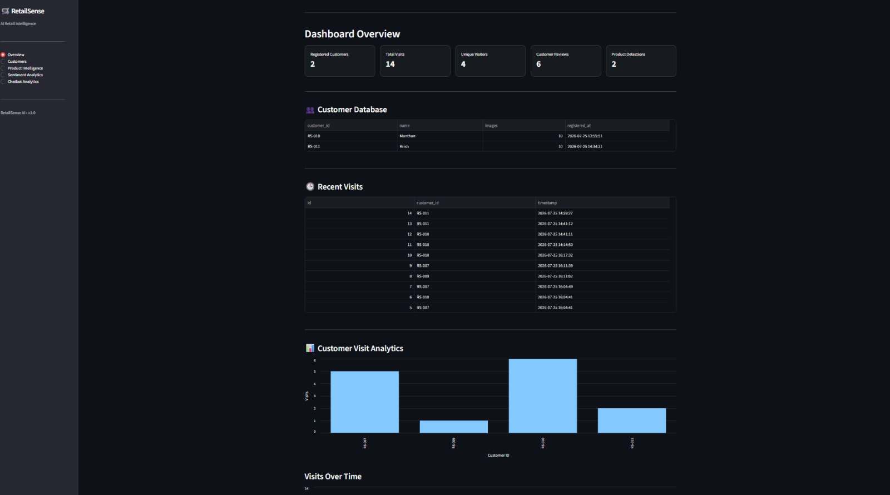
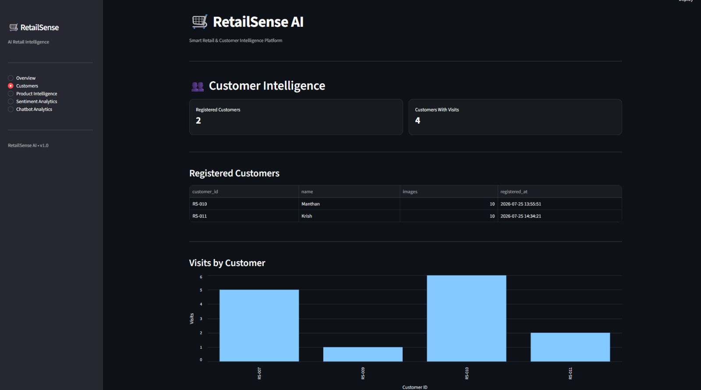
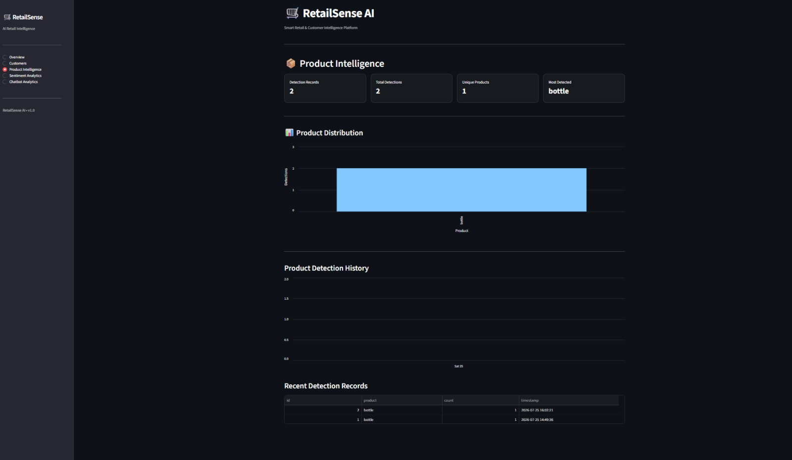
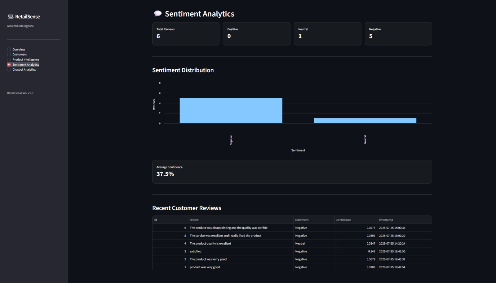
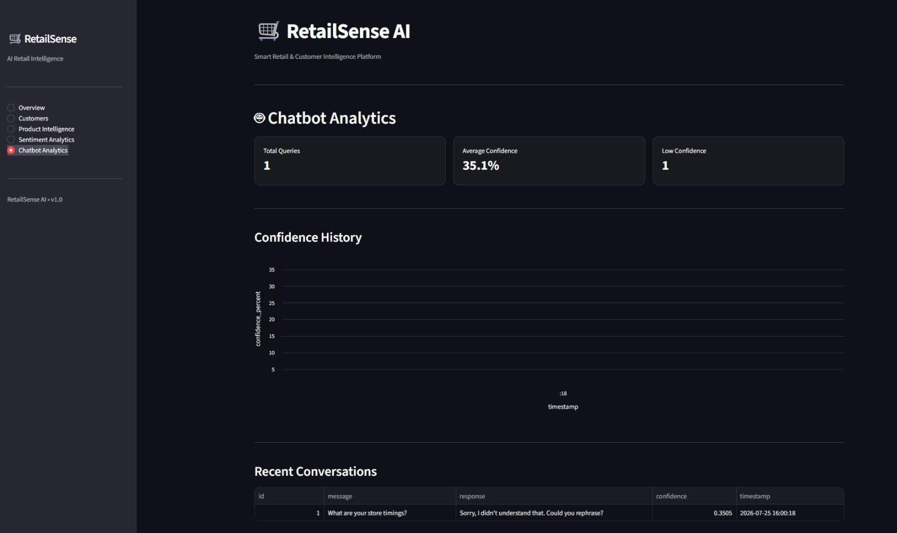

# 🛒 RetailSense AI

**RetailSense AI** is an AI-powered smart retail intelligence platform that combines computer vision, face recognition, NLP, machine learning, and analytics to understand customer activity and retail interactions.

The system identifies registered customers, tracks store visits, detects retail products in real time, analyzes customer feedback, provides an intelligent retail chatbot, and visualizes collected data through an interactive analytics dashboard.

## 🚀 Features

### 👤 Customer Recognition
- Customer registration using webcam
- Automated face image capture
- Face recognition using DeepFace and FaceNet512
- Unknown customer handling
- Duplicate visit prevention
- Customer visit tracking

### 📦 Product Intelligence
- Real-time product detection using YOLOv8
- Retail object filtering
- Product counting
- Detection history and analytics

### 💬 Sentiment Analysis
- Customer review analysis
- Positive, Neutral, and Negative classification
- Confidence scoring
- Sentiment analytics dashboard

### 🤖 Retail Chatbot
- ML-based intent classification
- Retail FAQ assistance
- Confidence-based fallback responses
- Conversation analytics

### 📊 Analytics Dashboard
Built using Streamlit with:

- Customer analytics
- Visit analytics
- Product intelligence
- Sentiment analytics
- Chatbot analytics
- KPI monitoring
- Historical trends

## 🧠 Technology Stack

**Languages:** Python, SQL

**Computer Vision:** OpenCV, YOLOv8, DeepFace, FaceNet512

**Machine Learning & NLP:** Scikit-learn, TensorFlow, Joblib

**Data & Analytics:** Pandas, SQLite

**Dashboard:** Streamlit

**Version Control:** Git, GitHub

## 🏗️ System Architecture

```text
                  RetailSense AI
                        │
        ┌───────────────┼───────────────┐
        │               │               │
 Face Recognition     YOLOv8          NLP / ML
        │               │               │
 Customer ID       Product Data     Reviews / Queries
        │               │               │
        └───────────────┬───────────────┘
                        │
                     SQLite
                        │
                        ▼
              Streamlit Dashboard
```

## 📂 Project Structure

```text
RetailSense_AI/
│
├── app/
│   ├── main.py
│   ├── customer_module/
│   ├── recognition_module/
│   ├── product_module/
│   ├── sentiment_module/
│   ├── chatbot_module/
│   └── database/
│
├── dashboard/
│   └── dashboard.py
│
├── datasets/
├── models/
├── requirements.txt
├── .gitignore
└── README.md
```

## ▶️ Running the Project

Install dependencies:

```bash
pip install -r requirements.txt
```

Run the main application:

```bash
python app/main.py
```

Run the analytics dashboard:

```bash
streamlit run dashboard/dashboard.py
```

## 🔄 Application Workflow

```text
Customer Registration
        ↓
Face Recognition
        ↓
Visit Tracking
        ↓
SQLite Database
        ↓
Analytics Dashboard

Product Detection ──────────┐
Sentiment Analysis ─────────┼──→ SQLite ──→ Dashboard
Retail Chatbot ─────────────┘
```
## 📸 Project Demo

### Analytics Dashboard


### AI Customer Recognition


### YOLOv8 Product Detection


### Sentiment Analytics


### Chatbot Analytics


## 🔐 Privacy

Captured customer face images, runtime databases, generated logs, and local environment files are excluded from version control.

## 🎯 Applications

RetailSense AI demonstrates how AI can support:

- Smart retail stores
- Customer engagement analysis
- Footfall intelligence
- Product interaction analytics
- Customer feedback analysis
- Automated customer assistance

## 📌 Project Status

**RetailSense AI v1.0 — Functional Prototype**

Core AI modules, centralized SQLite storage, and analytics dashboard integration are complete.